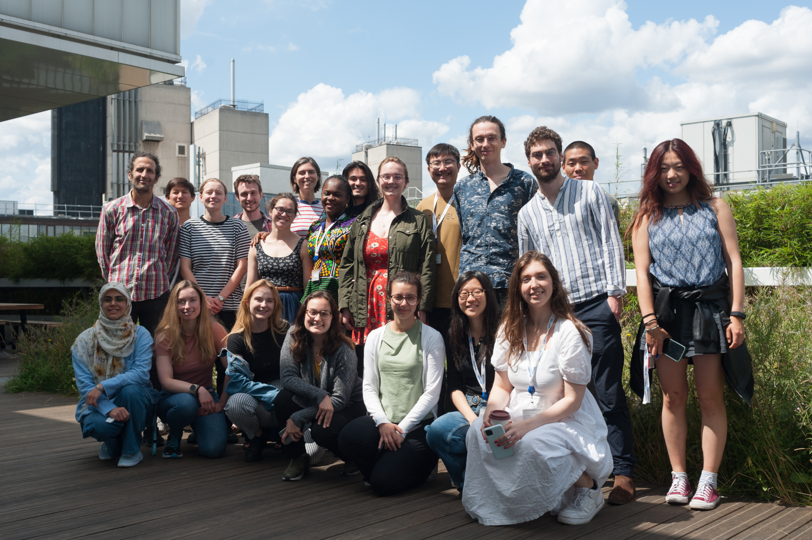

Repository for the 2023 edition of the GCNU Mathematics Bridging Program
=========================================================================

Please refer to the syllabus of the following program modules:

1. Linear algebra,

2. Calculus,

3. [Probability](probability/README.md)

4. Convolution, filters and Fourier analysis

5. Ordinary differential equations

Note: to install the dependencies needed to run the code provided here, please clone this repository and type ``pip install -e .`` from the root directory of the cloned repository.

