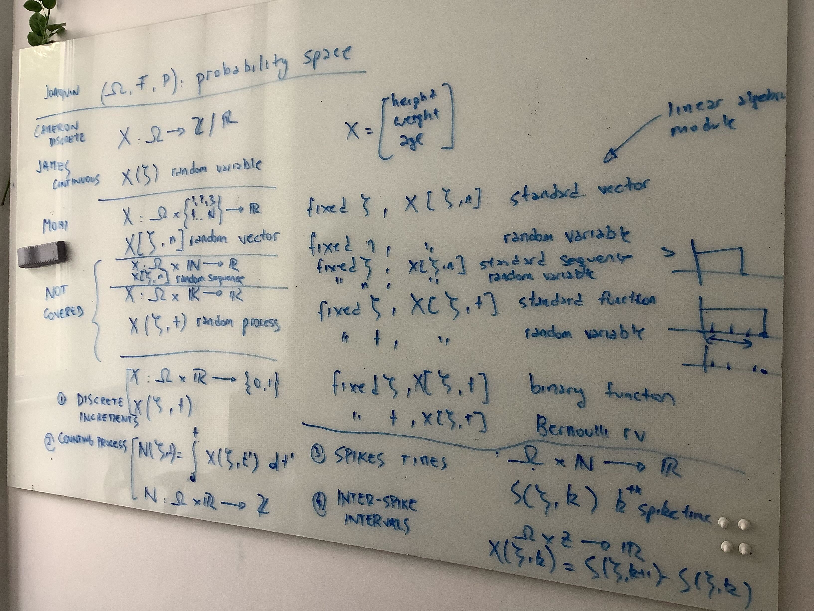

# Attendance

- Alberto

- Modhi

- George 

- Cameron (arrived at the end, but he will share a few suggestions about connecting functions of random variables with ML applications -- e.g., normalizing flows).

- Joaquin

James could not joins because he was sick and Laurence could not come because he was busy.

# Items discussed

- George discussed a few ideas about his Limit Theorems lecture. He decided not to cover the strong law of large numbers. He proposed to introduce statistical concepts like maximum likelihood estimation, that Joaquin will later use for the estimation of linear regression parameters.

- We agreed on not covering moment generating functions.

- Joaquin suggested Alberto to introduce the topics that we will cover in the module lectures by mentioning:

    1. probability spaces, 
    2. random variables,
    3. random vectors,
    4. random sequences,
    5. random processes.

    

- Joaquin mentioned that he will solve probability problems analytically and by simulation. George suggested that he mentions that the simulation approach works due to a law of large numbers and the central limit theorem.

# Next steps

- Wed May 31: all-modules group meeting

- Fri June 2: probability group meeting

    - discuss if/how to change things following the feedback from the all-modules group meeting

    - Cameron: structure of his Function of Random Variables lecture

    - Alberto and Joaquin: more detailed information (e.g., flow of the lecture, problem sets) on the first two lectures.

